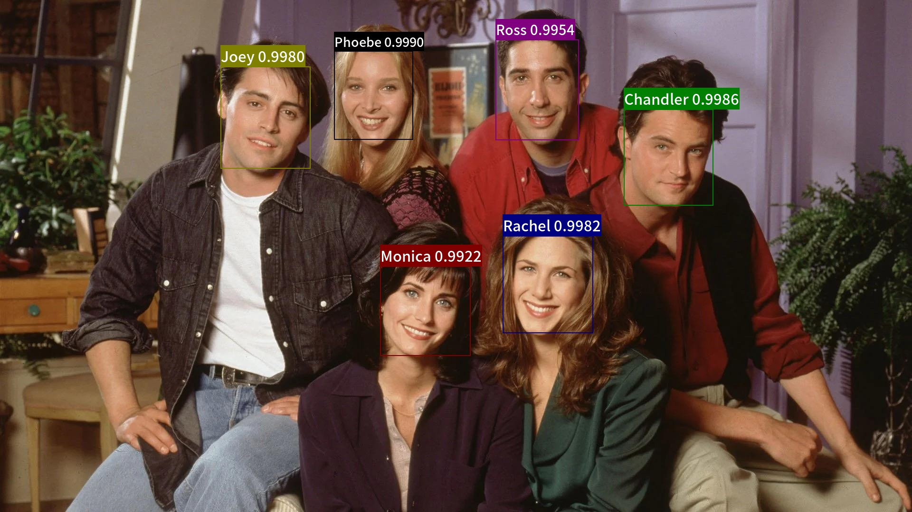

[简体中文](README_ch.md) | English

------------------------------------------------------------------------------------------

<p align="left">
    <a href="./LICENSE"></a>
    <a href="https://github.com/littletomatodonkey/insight-face-paddle/releases"></a>
    <a href=""></a>
    <a href=""></a>
    <a href=""></a>
    <a href="https://github.com/littletomatodonkey/insight-face-paddle/graphs/contributors"></a>
    <a href="https://pypi.org/project/insightface-paddle/"></a>
    <a href="https://github.com/littletomatodonkey/insight-face-paddle/stargazers"></a>
</p>

# InsightFace Paddle

## 1. Introduction

### 1.1 Overview

`InsightFacePaddle` is an open source deep face detection and recognition toolkit, powered by PaddlePaddle. `InsightFacePaddle` provide three related pretrained models now, include `BlazeFace` for face detection, `ArcFace` and `MobileFace` for face recognition.


- This tutorial is mainly about Whl package inference using `PaddleInfernence`.
- For face recognition task, please refer to: [Face recognition tuturial](https://github.com/deepinsight/insightface/blob/master/recognition/arcface_paddle/README_en.md).
- For face detection task, please refer to: [Face detection tuturial](https://github.com/deepinsight/insightface/blob/master/detection/blazeface_paddle/README_en.md).


### 1.2 Benchmark

For face detection task, on WiderFace dataset, the following table shows mAP, speed and time cost for BlazeFace.

| Model structure                  | Model size | WiderFace mAP   | CPU time cost | GPU time cost |
| :-------------------------: | :-----: | :-----: | :--------: | :--------: |
| BlazeFace-FPN-SSH-Paddle      | 0.65MB | 0.9187/0.8979/0.8168 | 31.7ms  |  5.6ms |
| RetinaFace      | 1.68MB | -/-/0.825 | 182.0ms  | 17.4ms |


For face recognition task, on MSAM dataset, the following table shows precision, speed and time cost for MobileFaceNet.


| Model structure           | lfw   | cfp_fp | agedb30  | CPU time cost | GPU time cost |
| :-------------------------: | :-----: | :------: | :-------: | :-------: | :--------: |
| MobileFaceNet-Paddle      | 0.9945 | 0.9343  | 0.9613 | 4.3ms | 2.3ms   |
| MobileFaceNet-mxnet | 0.9950 | 0.8894  | 0.9591   |  7.3ms | 4.7ms   |


**Benchmark environment:**
* CPU: Intel(R) Xeon(R) Gold 6184 CPU @ 2.40GHz
* GPU: a single NVIDIA Tesla V100


**Note:** Performance of `RetinaFace` is tested using script [test.py](https://github.com/deepinsight/insightface/blob/master/detection/retinaface/test.py). The image shape is modified to `640x480` here. Performance of `MobileFaceNet-mxnet` is tested using script [verification.py](https://github.com/deepinsight/insightface/blob/master/recognition/arcface_mxnet/verification.py).


### 1.3 Visualization

One example result predicted by `InsightFacePaddle` is as follow. Please refer to the [Demo](./demo/friends/output/) for more.

<div align="center">

</div>


### 1.4 Community

Scan the QR code below with your QQ (QQ group number: `705899115`) to discuss more about deep learning together.

<div align="center">

</div>


## 2. Installation
1. Install PaddlePaddle

PaddlePaddle 2.1 or later is required for `InsightFacePaddle`. You can use the following steps to install PaddlePaddle.

```bash
# for GPU
pip3 install paddlepaddle-gpu

# for CPU
pip3 install paddlepaddle
```
For more details about installation. please refer to [PaddlePaddle](https://www.paddlepaddle.org.cn/).

2. Install requirements

`InsightFacePaddle` dependencies are listed in `requirements.txt`, you can use the following command to install the dependencies.

```bash
pip3 install --upgrade -r requirements.txt -i https://mirror.baidu.com/pypi/simple
```

3. Install `InsightFacePaddle`

* [Recommanded] You can use `pip` to install the lastest version `InsightFacePaddle` from `pypi`.

```bash
pip3 install --upgrade insightface-paddle
```

* You can also build whl package and install by following commands.

```bash
cd ./InsightFacePaddle
python3 setup.py bdist_wheel
pip3 install dist/*
```

## 3. Quick Start

`InsightFacePaddle` support two ways of use, including `Commad Line` and `Python API`.

### 3.1 Command Line

You can use `InsightFacePaddle` in Command Line.

#### 3.1.1 Get help

You can get the help about `InsightFacePaddle` by following command.

```bash
insightfacepaddle -h
```

The args are as follows:
| args |  type | default | help |
| ---- | ---- | ---- | ---- |
| det_model | str | BlazeFace | The detection model. |
| rec_model | str | MobileFace | The recognition model. |
| use_gpu | bool | True | Whether use GPU to predict. Default by `True`. |
| enable_mkldnn | bool | False | Whether use MKLDNN to predict, valid only when `--use_gpu` is `False`. Default by `False`. |
| cpu_threads | int | 1 | The num of threads with CPU, valid only when `--use_gpu` is `False` and `--enable_mkldnn` is `True`. Default by `1`. |
| input | str | - | The path of video to be predicted. Or the path or directory of image file(s) to be predicted. |
| output | str | - | The directory to save prediction result. |
| det | bool | False | Whether to detect. |
| det_thresh | float | 0.8 | The threshold of detection postprocess. Default by `0.8`. |
| rec | bool | False | Whether to recognize. |
| index | str | - | The path of index file. |
| cdd_num | int | 5 | The number of candidates in the recognition retrieval. Default by `5`. |
| rec_thresh | float | 0.45 | The threshold of match in recognition, use to remove candidates with low similarity. Default by `0.45`. |
| max_batch_size | int | 1 | The maxium of batch_size to recognize. Default by `1`. |
| build_index | str | - | The path of index to be build. |
| img_dir | str | - | The img(s) dir used to build index. |
| label | str | - | The label file path used to build index. |


#### 3.1.2 Build index

If use recognition, before start predicting, you have to build the index.

```bash
insightfacepaddle --build_index ./demo/friends/index.bin --img_dir ./demo/friends/gallery --label ./demo/friends/gallery/label.txt
```

An example used to build index is as follows:
<div align="center">

</div>

#### 3.1.3 Predict

1. Detection only

* Image(s)

Use the image below to predict:
<div align="center">

</div>

The prediction command:
```bash
insightfacepaddle --det --input ./demo/friends/query/friends1.jpg --output ./output
```

The result is under the directory `./output`:
<div align="center">

</div>

* Video
```bash
insightfacepaddle --det --input ./demo/friends/query/friends.mp4 --output ./output
```

2. Recognition only

* Image(s)

Use the image below to predict:
<div align="center">

</div>

The prediction command:
```bash
insightfacepaddle --rec --index ./demo/friends/index.bin --input ./demo/friends/query/Rachel.png
```

The result is output in the terminal:
```bash
INFO:root:File: Rachel., predict label(s): ['Rachel']
```

3. Detection and recognition

* Image(s)

Use the image below to predict:
<div align="center">

</div>

The prediction command:
```bash
insightfacepaddle --det --rec --index ./demo/friends/index.bin --input ./demo/friends/query/friends2.jpg --output ./output
```

The result is under the directory `./output`:
<div align="center">

</div>

* Video
```bash
insightfacepaddle --det --rec --index ./demo/friends/index.bin --input ./demo/friends/query/friends.mp4 --output ./output
```

### 3.2 Python

You can use `InsightFacePaddle` in Python. First, import `InsightFacePaddle` and `logging` because `InsightFacePaddle` using that to control log.

```python
import insightface_paddle as face
import logging
logging.basicConfig(level=logging.INFO)
```

#### 3.2.1 Get help

```python
parser = face.parser()
help_info = parser.print_help()
print(help_info)
```

#### 3.2.2 Building index

```python
parser = face.parser()
args = parser.parse_args()
args.build_index = "./demo/friends/index.bin"
args.img_dir = "./demo/friends/gallery"
args.label = "./demo/friends/gallery/label.txt"
predictor = face.InsightFace(args)
predictor.build_index()
```

#### 3.2.3 Prediction

1. Detection only

* Image(s)
```python
parser = face.parser()
args = parser.parse_args()

args.det = True
args.output = "./output"
input_path = "./demo/friends/query/friends1.jpg"

predictor = face.InsightFace(args)
res = predictor.predict(input_path)
print(next(res))
```

* NumPy
```python
import cv2

parser = face.parser()
args = parser.parse_args()

args.det = True
args.output = "./output"
path = "./demo/friends/query/friends1.jpg"
img = cv2.imread(path)[:, :, ::-1]

predictor = face.InsightFace(args)
res = predictor.predict(img)
print(next(res))
```

The prediction result saved as `"./output/tmp.png"`.

* Video
```python
parser = face.parser()
args = parser.parse_args()

args.det = True
args.output = "./output"
input_path = "./demo/friends/query/friends.mp4"

predictor = face.InsightFace(args)
res = predictor.predict(input_path)
for _ in res:
    print(_)
```

2. Recognition only

* Image(s)
```python
parser = face.parser()
args = parser.parse_args()

args.rec = True
args.index = "./demo/friends/index.bin"
input_path = "./demo/friends/query/Rachel.png"

predictor = face.InsightFace(args)
res = predictor.predict(input_path, print_info=True)
next(res)
```

* NumPy
```python
import cv2

parser = face.parser()
args = parser.parse_args()

args.rec = True
args.index = "./demo/friends/index.bin"
path = "./demo/friends/query/Rachel.png"
img = cv2.imread(path)[:, :, ::-1]

predictor = face.InsightFace(args)
res = predictor.predict(img, print_info=True)
next(res)
```

3. Detection and recognition

* Image(s)
```python
parser = face.parser()
args = parser.parse_args()

args.det = True
args.rec = True
args.index = "./demo/friends/index.bin"
args.output = "./output"
input_path = "./demo/friends/query/friends2.jpg"

predictor = face.InsightFace(args)
res = predictor.predict(input_path, print_info=True)
next(res)
```

* NumPy
```python
import cv2

parser = face.parser()
args = parser.parse_args()

args.det = True
args.rec = True
args.index = "./demo/friends/index.bin"
args.output = "./output"
path = "./demo/friends/query/friends2.jpg"
img = cv2.imread(path)[:, :, ::-1]

predictor = face.InsightFace(args)
res = predictor.predict(img, print_info=True)
next(res)
```

The prediction result saved as `"./output/tmp.png"`.

* Video
```python
parser = face.parser()
args = parser.parse_args()

args.det = True
args.rec = True
args.index = "./demo/friends/index.bin"
args.output = "./output"
input_path = "./demo/friends/query/friends.mp4"

predictor = face.InsightFace(args)
res = predictor.predict(input_path, print_info=True)
for _ in res:
    pass
```
